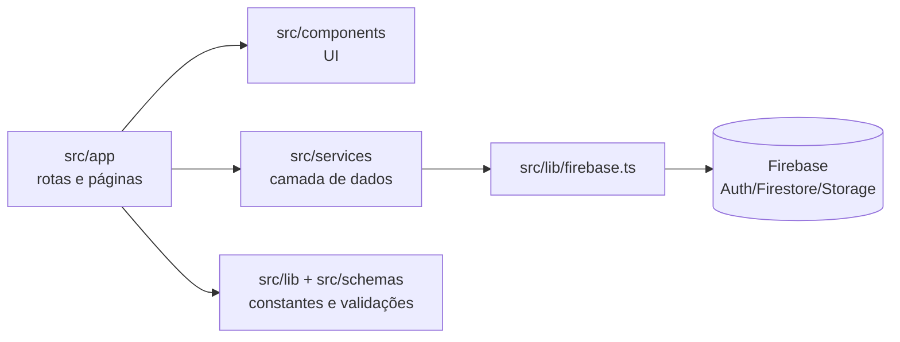

# Luratha Frontend

Frontend da **Luratha**, marca brasileira de slow fashion feminino.  
Este repositório foi preparado para portfólio técnico: mostra estrutura real de e-commerce com Next.js App Router, Firebase e cobertura de testes.

## Stack

| Camada | Tecnologia |
|---|---|
| Framework | Next.js 16.2.2 (App Router) |
| UI | React 19 + TypeScript strict |
| Estilo | Tailwind CSS v4 + CSS Modules |
| Backend (BaaS) | Firebase (Auth, Firestore, Storage, App Hosting) |
| Testes | Vitest + React Testing Library + Playwright |

## Pré-requisitos

- Node.js 22
- npm 10
- Firebase CLI (`npm install -g firebase-tools@latest`)
- Playwright Chromium (`npx playwright install --with-deps chromium`)

## Como rodar localmente

1. Instale dependências:
   ```bash
   npm ci
   ```
2. Inicie o projeto:
   ```bash
   npm run dev
   ```
3. Acesse: `http://localhost:3000`

## Scripts principais

| Comando | Uso |
|---|---|
| `npm run dev` | Desenvolvimento local |
| `npm run build` | Build de produção |
| `npm run start` | Servir build |
| `npm run lint` | ESLint |
| `npm test` | Testes unitários/integrados (Vitest) |
| `npm run test:firestore` | Integração com Firebase Emulator |
| `npm run test:e2e` | E2E com Playwright |
| `npm run setup:routes` | Geração de rotas de catálogo |

## Ordem de validação (qualidade)

```bash
npm ci
npm run lint
npm test
npm run test:e2e
```

Quando houver mudanças em schemas ou fluxos Firebase, rode também:

```bash
npm run test:firestore
```

## Arquitetura (visão rápida)



Pastas mais importantes:

- `src/app/`: rotas, layouts, metadata, sitemap e robots
- `src/components/`: componentes reutilizáveis e componentes por domínio
- `src/services/`: regras de acesso a dados
- `src/schemas/`: contratos/validações de domínio
- `e2e/`: testes end-to-end
- `docs/`: guias operacionais (ex.: testes e emulator)

## Qualidade de engenharia (padrões do projeto)

- **Arquitetura:** separação clara entre rota, UI, serviço e schema
- **Código:** TypeScript strict e imports por alias `@/src/...`
- **Acessibilidade:** estrutura semântica, foco visível e interações por teclado
- **Performance:** preferência por Server Components; usar `"use client"` apenas quando necessário
- **Segurança:** sem segredos no código; uso de `NEXT_PUBLIC_FIREBASE_*` e regras Firebase
- **Manutenibilidade:** documentação curta, sem duplicação e alinhada aos arquivos-fonte

## SEO, AEO e GEO

O projeto já contempla:

- Metadata por rota
- JSON-LD (schema.org)
- `src/app/sitemap.ts`
- `src/app/robots.ts`
- `public/llms.txt`

## Referências de documentação

- Guia de testes: `docs/testing.md`
- Firebase Emulator + CRUD: `docs/firestore-crud-emulator.md`
- Instruções de contribuição técnica: `.github/copilot-instructions.md`
