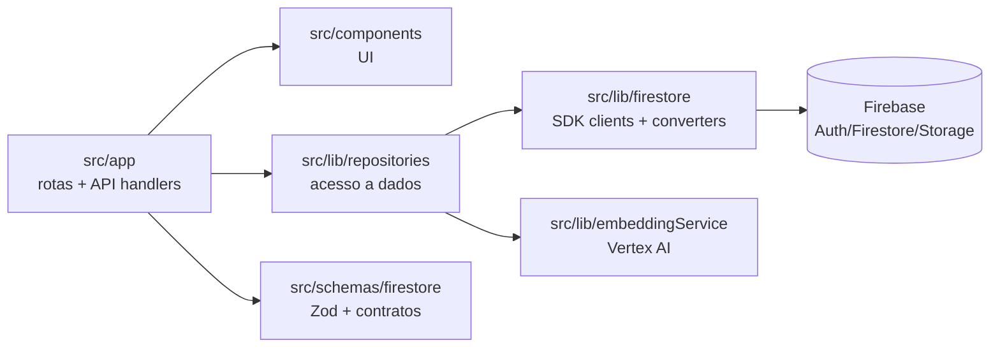

# Luratha Frontend

> ## ⚠️ Work in Progress
>
> Este repositório é um **frontend em desenvolvimento** e **não é a versão em produção** da Luratha. A loja oficial em [`luratha.com.br`](https://www.luratha.com.br) hoje roda em outra plataforma;
>
> **Não use em produção.**


---

## Sobre o projeto

Frontend da **Luratha**, marca brasileira de slow fashion feminina (vestidos, blusas, calças, saias, conjuntos, moletons e acessórios artesanais).

Este repositório existe com dois objetivos:

1. **Substituir o frontend atual** de [`luratha.com.br`](https://www.luratha.com.br) por uma stack moderna (Next.js App Router + Firebase) com cobertura de testes ponta-a-ponta.
2. **Servir de portfólio técnico** mostrando a estrutura real de um e-commerce: catálogo, busca vetorial, carrinho, checkout, área do cliente e fluxos administrativos.

### O que já existe (catálogo + storefront)

- Páginas públicas: home, categorias, produto, busca, sobre, contato, política de trocas, referência de medidas
- Autenticação (e-mail/senha + Google) via Firebase Auth
- Carrinho persistido em Firestore por usuário
- Busca por similaridade vetorial (Vertex AI embeddings + `findNearest`)
- API CRUD de produtos, categorias, estoque, imagens, pedidos e endereços
- Área do cliente (`/conta`): dashboard, dados pessoais, endereços, pedidos
- Cobertura de testes em três níveis (Vitest unit, Vitest cloud-integration, Playwright E2E contra projeto real)

### O que ainda falta (resumo)

- **Auth/AuthZ middleware** nas rotas de API — atualmente abertas
- Fluxo de checkout (intent de pagamento, cálculo de frete, confirmação)
- Webhooks de pagamento e baixa de estoque transacional
- Painel administrativo do catálogo
- Integração com gateway de pagamento e meios logísticos
- Rate limiting e proteções contra abuso

Roadmap detalhado em [`plan/checkout-flow-roadmap.md`](./plan/checkout-flow-roadmap.md).

## Stack

| Camada | Tecnologia |
|---|---|
| Framework | Next.js 16.2.2 (App Router, Turbopack) |
| UI | React 19 + TypeScript strict |
| Estilo | Tailwind CSS v4 + CSS Modules |
| Backend (BaaS) | Firebase (Auth, Firestore, Storage, App Hosting, Functions) |
| Embeddings/IA | Vertex AI (`text-embedding-005`) |
| Testes | Vitest + React Testing Library + Playwright |
| CI | GitHub Actions (lint/typecheck, unit, cloud-integration, E2E, deploy de Functions) |

## Pré-requisitos

- Node.js 22, npm 10
- Firebase CLI (`npm install -g firebase-tools@latest`)
- Playwright Chromium (`npx playwright install --with-deps chromium`)
- Para rodar suites cloud (`test:firestore`, `test:e2e`, etc.) — credenciais do projeto de teste em variáveis de ambiente:
  - `FIREBASE_SERVICE_ACCOUNT_BASE64`
  - `FIREBASE_WEB_APP_CONFIG_BASE64`
  - `NEXT_PUBLIC_FIREBASE_*`

  Sem essas variáveis, as suites cloud são puladas automaticamente.

## Como rodar localmente

```bash
npm ci
npm run dev      # http://localhost:3000
```

## Scripts principais

| Comando | Uso |
|---|---|
| `npm run dev` | Dev server (Turbopack) |
| `npm run build` | Build de produção |
| `npm run start` | Servir build |
| `npm run lint` | ESLint |
| `npm test` | Testes unitários/componentes (Vitest, jsdom — sem rede) |
| `npm run test:coverage` | Mesma suite com relatório de cobertura |
| `npm run test:firestore` | Integração contra Firestore real do projeto de teste |
| `npm run test:functions:cloud` | Triggers de Cloud Functions deployados |
| `npm run test:e2e` | Playwright contra o projeto de teste |
| `npm run test:e2e:ui` | Playwright em modo UI |

## Ordem de validação

```bash
npx tsc --noEmit
npm run lint
npm test
npm run test:e2e
```

Para mudanças em schemas, queries ou fluxos Firebase, rodar também:

```bash
npm run test:firestore
```

## Arquitetura (visão rápida)



Pastas relevantes:

- `src/app/` — rotas, layouts, metadata, sitemap, robots, API handlers
- `src/app/api/` — CRUD por entidade (cada método em arquivo próprio)
- `src/components/` — UI compartilhada e componentes por domínio (`categoria/`, `produto/`, `conta/`)
- `src/lib/firestore/` — wrappers do SDK (client/SSR/admin) e DataConverters
- `src/lib/repositories/` — camada de acesso a Firestore
- `src/schemas/firestore/` — schemas Zod (contrato único de dados)
- `e2e/` — specs Playwright (rodam contra projeto real)
- `src/test/cloud/`, `src/test/cloud-functions/` — suites de integração contra `luratha-96386`
- `functions/` — Cloud Functions (gatilhos Firestore e Storage)
- `docs/` — guias operacionais

## Padrões de engenharia

- **TypeScript strict** com imports por alias `@/src/...`
- Preferência por **Server Components**; `"use client"` apenas quando necessário
- **CSS Modules** + design tokens em `src/app/globals.css` (`var(--color-*)`, `var(--font-*)`) — nada de hex hard-coded
- **Acessibilidade**: landmarks semânticos, um `<h1>` por página, foco visível, `alt` descritivo
- **SEO**: cada rota com metadata, JSON-LD, canonical e atualização de `sitemap.ts`/`robots.ts`/`llms.txt`
- **Segurança de credenciais**: nenhum secret no código; tudo via env (`FIREBASE_SERVICE_ACCOUNT_BASE64`, etc.) ou GitHub Actions secrets

## SEO / AEO / GEO

Já contemplados:

- Metadata por rota (`generateMetadata`)
- JSON-LD via componente `<JsonLd>` (Product, BreadcrumbList, ContactPage, LocalBusiness, etc.)
- `src/app/sitemap.ts` e `src/app/robots.ts` dinâmicos
- `public/llms.txt` para descobribilidade por LLMs

## Documentação adicional

- Guia de testes — [`docs/testing.md`](./docs/testing.md)
- Guia de CRUD/Firestore — [`docs/firestore-crud-emulator.md`](./docs/firestore-crud-emulator.md)
- Roadmap de checkout — [`plan/checkout-flow-roadmap.md`](./plan/checkout-flow-roadmap.md)
- Convenções para agentes (Claude Code, Copilot) — [`CLAUDE.md`](./CLAUDE.md)

## Licença e uso

Repositório pessoal exposto publicamente como portfólio técnico. O conteúdo de marca (logo, manifesto, nomes de produto) pertence à Luratha; o código pode ser estudado livremente. Não use a marca "Luratha" em derivados.
